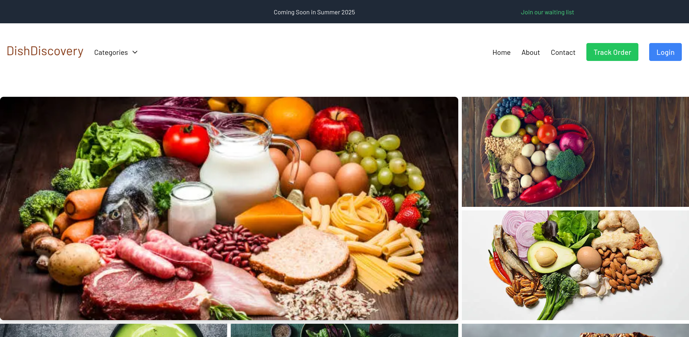

# Dish Discovery App

## Overview

The Dish Discovery App is a web application designed to help users explore and discover various dishes from around the world. Built using Next.js and integrated with NextAuth for authentication, this app allows users to create accounts, log in, and manage their favorite dishes.



[Dish Discovery Deployment Link](https://dish-dishcovery-44ihk8a1j-bluette1s-projects.vercel.app/)

[Dish Discovery API Sourcecode](https://github.com/Bluette1/dish-discovery-api)

[Dish Discovery API Link](https://dish-discovery-api-3a9612859754.herokuapp.com)

## Features

- User authentication with NextAuth
- Role-based access for admin users
- Dish discovery with detailed views
- User-friendly interface with responsive design
- Admin dashboard for managing dishes and users

## Technologies Used

- **Frontend**: Next.js, React
- **Styling**: Tailwind CSS (or any other CSS framework you prefer)
- **Authentication**: NextAuth
- **Database**: MongoDB
- **State Management**: React Context API

## Getting Started

To get a local copy of the project up and running, follow these steps:

### Prerequisites

- Node.js (version X.X.X)
- npm (version X.X.X) or Yarn

### Installation

1. Clone the repository:

   ```bash
   git clone https://github.com/Bluette1/dish-dishcovery-app.git
   ```

2. Navigate to the project directory:

   ```bash
   cd dish-dishcovery-app
   ```

3. Install dependencies:

   ```bash
   npm install
   # or
   yarn install
   ```

4. Set up environment variables:

   Create a `.env.local` file in the root of the project and add your environment variables. An example is provided in `.env.example`.

5. Run the development server:

   ```bash
   npm run dev
   # or
   yarn dev
   ```

6. Open your browser and navigate to [http://localhost:3000](http://localhost:3000).

## Usage

- **User Authentication**: Users can sign up and log in to manage their favorite dishes.
- **Admin Panel**: Admin users can manage dishes and user accounts.

## Contributing

Contributions are welcome! If you'd like to contribute, please follow these steps:

1. Fork the repository.
2. Create a new branch for your feature or bug fix.
3. Make your changes and commit them.
4. Push to your branch.
5. Open a pull request.

## User Stories

For a comprehensive overview of the user stories for the DishDiscovery app, please refer to our [Notion User Stories](https://www.notion.so/User-Stories-116e6a4d98f280a48a02db13508c943f?pvs=4).

## License

This project is licensed under the MIT License. See the [LICENSE](LICENSE) file for details.

## Acknowledgments

- Inspiration and resources from various online tutorials and documentation.
- [Next.js Documentation](https://nextjs.org/docs)
- [NextAuth Documentation](https://next-auth.js.org/getting-started/introduction)
